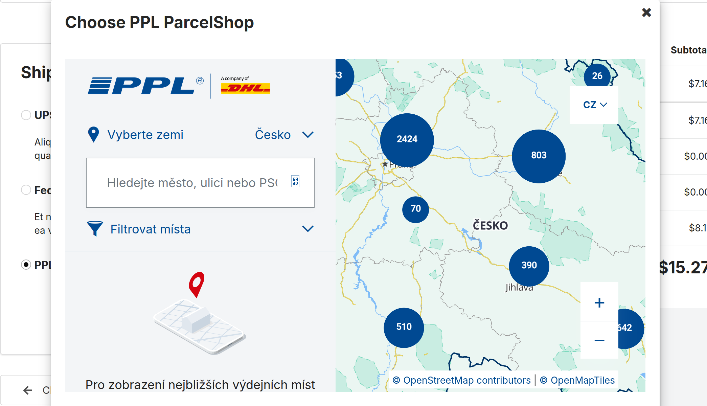

<p align="center">
    <a href="https://www.3brs.com" target="_blank">
        
    </a>
</p>
<h1 align="center">
    PPL parcelshop plugin
    <br />
    <a href="https://packagist.org/packages/3BRS/sylius-ppl-parcelshops-plugin" title="License" target="_blank">
        
    </a>
    <a href="https://packagist.org/packages/3BRS/sylius-ppl-parcelshops-plugin" title="Version" target="_blank">
        
    </a>
    <a href="https://github.com/3BRS/sylius-ppl-parcelshops/actions/workflows/tests.yml" title="Build status" target="_blank">
        
    </a>
</h1>

## Requirements

| Package | Version |
|---------|---------|
| PHP | ^8.2 |
| Sylius | ^2.0 |

> For Sylius 1.x support, use version 1.x of this plugin.

## Features

 - Enables sending shipments via <a href="https://www.ppl.cz/co-jsou-vydejni-mista">PPL</a> to PPL parcelshops.
 - The user can choose the PPL parcelshops from the <a href="https://www.ppl.cz/mapa-vydejnich-mist">map</a> during checkout in the Shipment step
 
 - See PPL parcelshop in final checkout step and also in the admin panel.
 - Export CSV with the PPL parcelshops shipments and import it easily into PPL's system.

## PPL CSV import configuration

- Configure CSV structure in your client zone https://klient.ppl.cz
  - Navigation (in Czech) https://webkv.cz/faq/jak-nastavit-sablonu-pro-import-objednavek-z-e-shopu-do-ppl-klient.html

## Installation

### 1. Install the plugin via Composer

```bash
composer require 3brs/sylius-ppl-parcelshops-plugin
```

### 2. Register the bundles

Add plugin classes to your `config/bundles.php`:

```php
return [
    // ...
    ThreeBRS\SyliusShipmentExportPlugin\ThreeBRSSyliusShipmentExportPlugin::class => ['all' => true],
    ThreeBRS\SyliusPplParcelshopsPlugin\ThreeBRSSyliusPplParcelshopsPlugin::class => ['all' => true],
];
```

### 3. Import routing

Add routing to `config/routes.yaml`:

```yaml
threebrs_sylius_shipment_export_plugin:
    resource: "@ThreeBRSSyliusShipmentExportPlugin/Resources/config/admin_routing.yml"
    prefix: '/%sylius_admin.path_name%'

threebrs_sylius_ppl_parcelshops_plugin:
    resource: '@ThreeBRSSyliusPplParcelshopsPlugin/Resources/config/routing.yaml'
    prefix: /
```

### 4. Import plugin configuration

Add config import to `config/packages/_sylius.yaml`:

```yaml
imports:
    # ...
    - { resource: "@ThreeBRSSyliusShipmentExportPlugin/Resources/config/config.yml" }
    - { resource: "@ThreeBRSSyliusPplParcelshopsPlugin/Resources/config/config.yaml" }
```

### 5. Configure entity models

Your Entity `Shipment` has to implement `\ThreeBRS\SyliusPplParcelshopsPlugin\Model\PplShipmentInterface`.
You can use the trait `\ThreeBRS\SyliusPplParcelshopsPlugin\Model\PplShipmentTrait`.

Example:

```php
<?php

namespace App\Entity\Shipping;

use Doctrine\ORM\Mapping as ORM;
use Sylius\Component\Core\Model\Shipment as BaseShipment;
use ThreeBRS\SyliusPplParcelshopsPlugin\Model\PplShipmentInterface;
use ThreeBRS\SyliusPplParcelshopsPlugin\Model\PplShipmentTrait;

#[ORM\Entity]
#[ORM\Table(name: 'sylius_shipment')]
class Shipment extends BaseShipment implements PplShipmentInterface
{
    use PplShipmentTrait;
}
```

Your Entity `ShippingMethod` has to implement `\ThreeBRS\SyliusPplParcelshopsPlugin\Model\PplShippingMethodInterface`.
You can use the trait `\ThreeBRS\SyliusPplParcelshopsPlugin\Model\PplShippingMethodTrait`.

Example:

```php
<?php

namespace App\Entity\Shipping;

use Doctrine\ORM\Mapping as ORM;
use Sylius\Component\Core\Model\ShippingMethod as BaseShippingMethod;
use ThreeBRS\SyliusPplParcelshopsPlugin\Model\PplShippingMethodInterface;
use ThreeBRS\SyliusPplParcelshopsPlugin\Model\PplShippingMethodTrait;

#[ORM\Entity]
#[ORM\Table(name: 'sylius_shipping_method')]
class ShippingMethod extends BaseShippingMethod implements PplShippingMethodInterface
{
    use PplShippingMethodTrait;
}
```

For more details on entity customization, see [Sylius docs - Customizing Models](https://docs.sylius.com/en/latest/customization/model.html).

### 6. Create and run database migrations

Generate and run doctrine migrations to add the required database columns:

```bash
bin/console doctrine:migrations:diff
bin/console doctrine:migrations:migrate
```

## Configuration

The plugin can be configured using the following parameters in your `config/packages/_sylius.yaml` or `config/services.yaml`:

```yaml
parameters:
    # Shipping method codes that should be exported to PPL CSV format
    # Default: ['ppl_parcel_shop']
    # IMPORTANT: Only shipments using shipping methods with these codes will be exported
    threebrs_sylius_ppl_parcelshops_plugin_ppl_shipping_method_codes: ['ppl_parcel_shop', 'your_custom_ppl_method']

    # Country codes where PPL parcelshop service is available
    # Default: ['CZ', 'SK', 'DE', 'PL', 'HU', 'BG', 'RO', 'NL', 'AT']
    threebrs_sylius_ppl_parcelshops_plugin_ppl_countries: ['CZ', 'SK', 'DE', 'PL', 'HU', 'BG', 'RO', 'NL', 'AT']
```

**Note:** The `threebrs_sylius_ppl_parcelshops_plugin_ppl_shipping_method_codes` parameter determines which shipments will appear in the export list. Make sure your shipping method code matches one of the codes in this array, otherwise the shipments won't be available for export.

## Usage

### 1. Create a PPL Parcelshop Shipping Method

1. Go to the admin panel: **Shipping Methods** → **Create**
2. Fill in the basic information:
   - **Code**: Use `ppl_parcel_shop` (default) or a custom code that matches the `threebrs_sylius_ppl_parcelshops_plugin_ppl_shipping_method_codes` parameter
   - **Zone**: Select appropriate shipping zone
   - **Calculator**: Choose your preferred shipping calculator
3. Check the **"To PPL ParcelShop enabled"** option
4. Configure PPL country options:
   - **Display ParcelShops from selected countries**: Choose which countries' parcelshops should be available for selection (multiple selection allowed)
   - **Default selected country on the map with ParcelShops**: Choose which country will be pre-selected when the parcelshop map opens
5. Save the shipping method

**Important:** The shipping method code must be listed in the `threebrs_sylius_ppl_parcelshops_plugin_ppl_shipping_method_codes` parameter (see Configuration section above). If using a custom code, add it to this parameter in your configuration.

### 2. Customer Checkout Flow

When a customer selects a PPL parcelshop shipping method during checkout:

1. A PPL parcelshop selector widget will appear
2. The customer can choose their preferred parcelshop from an interactive map
3. The selected parcelshop information (ID, name, address) is saved with the shipment
4. The parcelshop details are visible in the order confirmation

### 3. Export Shipments to PPL

1. Go to the admin panel: **Shipment Export**
2. Select the PPL ParcelShop exporter type
3. Choose the shipments you want to export
4. Click **Export** to download a CSV file
5. Import the CSV file into PPL's system

The CSV export includes all necessary information for PPL processing:
- Parcelshop ID and details
- Recipient information
- Package weight and dimensions
- Cash on delivery amount (if applicable)
- Order reference

## Development

### Usage

- Develop your plugin in `/src`
- See `bin/` for useful commands

### Testing


After your changes you must ensure that the tests are still passing.

```bash
$ composer install
$ bin/console doctrine:schema:create -e test
$ bin/behat
$ bin/phpstan.sh
$ bin/ecs.sh
```

License
-------
This library is under the MIT license.

Credits
-------
Developed by [3BRS](https://3brs.com)<br>
Forked from [manGoweb](https://github.com/mangoweb-sylius/SyliusPplParcelshopsPlugin).
